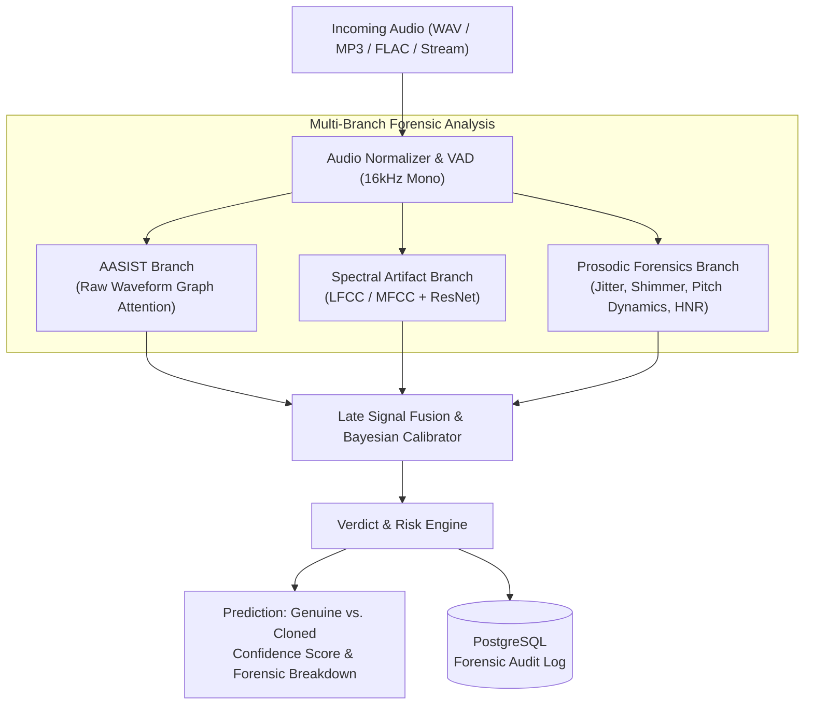

# VoxShield 🛡️ — AI-Powered Voice Cloning Fraud Detection

[](https://opensource.org/licenses/MIT)
[](https://www.python.org/)
[](https://fastapi.tiangolo.com/)
[](https://react.dev/)
[](https://www.docker.com/)

**VoxShield** is an advanced, production-grade anti-spoofing and audio forensics system engineered to detect voice-cloning fraud, deepfakes, and synthesized speech attacks in real time and batch workflows.

---

## 📌 Problem Statement (Smart India Hackathon)

The rapid democratization of generative artificial intelligence and zero-shot neural voice cloning models (e.g., ElevenLabs, VALL-E, Bark, RVC) has created unprecedented cybersecurity and financial fraud vulnerabilities. Threat actors leverage short voice samples harvested from social media to impersonate executives, banking customers, or family members to conduct:
- **Authorised Push Payment (APP) and Wire Fraud**
- **CEO Fraud & Impersonation Scams**
- **Emergency / Kidnap Ransom Social Engineering**
- **Bypassing Voice Biometric Authentication in Call Centers**

VoxShield addresses the SIH challenge of **Real-Time Voice Cloning Detection** by providing an institutional-grade, multi-stage detection pipeline that combines raw waveform graph attention networks, spectral artifact analysis, and acoustic prosody forensics into an explainable fraud defense system.

---

## 🔬 Architecture & Signal Fusion Pipeline

VoxShield utilizes a multi-branch signal fusion architecture designed to detect both vocoder synthesis signatures and subtle biological inconsistencies that generative models fail to simulate.



### Signal Pipeline Components
1. **Raw Waveform Graph Attention (AASIST)**: Directly operates on raw time-domain audio to detect vocoder synthesis discontinuities, phase anomalies, and high-frequency spectral replication artifacts without lossy time-frequency conversions.
2. **Spectral & Cepstral Artifact Analysis (LFCC/MFCC)**: Linear Frequency Cepstral Coefficients (LFCC) capture linear spectral distribution and high-frequency artifacts typical of neural vocoders (e.g., HiFi-GAN, WaveGlow).
3. **Acoustic & Prosodic Biometrics**: Analyzes micro-prosody, jitter (frequency instability), shimmer (amplitude perturbation), pitch contour continuity, and Harmonic-to-Noise Ratio (HNR) to identify the lack of human vocal tract dynamics and breathing mechanics.
4. **Late Fusion Classifier**: Weighted decision network with temperature-calibrated probabilities providing fine-grained confidence scores, latency guarantees, and explainable acoustic feature attribution.

---

## 🛠️ Tech Stack

| Layer | Technologies |
|---|---|
| **Backend & AI Pipeline** | Python 3.11+, FastAPI, PyTorch, Torchaudio, Librosa, SoundFile, NumPy, SciPy |
| **Data Persistence** | PostgreSQL 15, SQLAlchemy 2.0 (asyncpg), Alembic migrations, Pydantic v2 |
| **Frontend Dashboard** | React 18, TypeScript (Strict), Vite, Tailwind CSS, Lucide React, Recharts |
| **DevOps & Containerization** | Docker, Docker Compose, Alpine Linux |

---

## ⚙️ Prerequisites

- **Python**: `3.11` or higher
- **Node.js**: `18.x` or `20.x` LTS (with npm)
- **PostgreSQL**: `15+` (optional if using Docker)
- **System Audio Utilities**: `ffmpeg` and `libsndfile1`
- **Docker & Docker Compose**: (Recommended for rapid deployment)

---

## 🚀 Quick Start with Docker

The fastest way to deploy the entire VoxShield suite (PostgreSQL database, FastAPI backend, and React dashboard):

```bash
# 1. Clone the repository
git clone https://github.com/your-org/voxshield.git
cd voxshield

# 2. Start all services via Docker Compose
docker compose up --build
```

- **Frontend Application**: [http://localhost:5173](http://localhost:5173)
- **Interactive API Documentation (Swagger)**: [http://localhost:8000/docs](http://localhost:8000/docs)
- **API Health Check**: [http://localhost:8000/api/v1/health](http://localhost:8000/api/v1/health)

---

## 💻 Manual Setup & Local Development

### 1. Backend Setup

```bash
cd backend

# Create and activate Python virtual environment
python -m venv venv
# On Windows:
.\venv\Scripts\activate
# On Linux/macOS:
source venv/bin/activate

# Install dependencies
pip install --upgrade pip
pip install -r requirements.txt

# Create environment configuration
cp .env.example .env  # Configure your DATABASE_URL and SECRET_KEY

# Download pretrained AASIST model weights (place in backend/weights/)
# Example: weights/AASIST.pth

# Apply database migrations
alembic upgrade head

# Start development server
uvicorn app.main:app --host 0.0.0.0 --port 8000 --reload
```

### 2. Frontend Setup

```bash
cd frontend

# Install dependencies
npm install

# Start Vite development server
npm run dev
```

The frontend will run on [http://localhost:5173](http://localhost:5173) with automatic proxying to backend on port 8000.

---

## 📡 API Endpoints Summary

| Method | Endpoint | Description | Request Payload | Response |
|---|---|---|---|---|
| `GET` | `/api/v1/health` | Service and ML model health check | None | `{ status: "ok", models_loaded: true }` |
| `POST` | `/api/v1/detect/audio` | Analyze uploaded audio file | `multipart/form-data` (file) | Analysis report with confidence & verdict |
| `POST` | `/api/v1/detect/stream` | Chunked streaming audio ingestion | Audio buffer binary / chunk | Partial or aggregated risk score |
| `GET` | `/api/v1/analyses` | Query historical analysis records | Query params (`limit`, `offset`, `verdict`) | Paginated list of past analyses |
| `GET` | `/api/v1/analyses/{id}` | Detailed forensic breakdown by ID | Path parameter `id` (UUID) | Full spectral, prosodic, and model breakdown |
| `DELETE` | `/api/v1/analyses/{id}` | Delete an analysis record & file | Path parameter `id` (UUID) | Deletion status |
| `WS` | `/ws/detect` | WebSocket real-time audio detection | Raw audio binary frames | Real-time stream classification events |

---

## 📁 Project Structure

```text
VOICE-Detector/
├── .gitignore                     # Git ignore rules for Python, Node, media, weights
├── docker-compose.yml             # Orchestration for PostgreSQL, Backend, Frontend
├── README.md                      # Project documentation and setup guide
├── backend/                       # FastAPI Backend & ML Engine
│   ├── Dockerfile                 # Backend container definition
│   ├── requirements.txt           # Python dependencies
│   ├── alembic.ini                # Alembic migration configuration
│   ├── weights/                   # Pretrained ML model checkpoints (*.pth)
│   │   └── .gitkeep
│   ├── uploads/                   # Temporary audio upload storage
│   │   └── .gitkeep
│   └── app/
│       ├── main.py                # FastAPI application entrypoint
│       ├── api/                   # API routers and endpoints
│       │   ├── v1/
│       │   └── deps.py
│       ├── core/                  # Core configurations, logging, security
│       ├── models/                # SQLAlchemy database models
│       ├── schemas/               # Pydantic validation schemas
│       ├── ml/                    # ML pipeline, AASIST, prosody, spectral extraction
│       └── services/              # Audio ingestion and detection services
├── frontend/                      # React + TypeScript + Vite Dashboard
│   ├── package.json               # Frontend dependencies
│   ├── vite.config.ts             # Vite configuration
│   ├── tailwind.config.js         # Tailwind styling
│   └── src/
│       ├── components/            # UI widgets, audio player, waveforms, charts
│       ├── pages/                 # Dashboard, Analysis, History, Settings
│       ├── hooks/                 # Custom React hooks (audio recording, queries)
│       └── services/              # Axios / WebSocket API clients
└── samples/                       # Benchmark and verification audio samples
    ├── genuine/                   # Valid human voice samples
    │   └── .gitkeep
    └── cloned/                    # Deepfake / synthesized speech samples
        └── .gitkeep
```

---

## 🔒 Security & Privacy

- **Data Retention**: Uploaded audio files for one-off analyses can be configured for automatic secure purge after processing.
- **Biometric Protection**: Audio features and embeddings are stored with strict access controls to adhere to data privacy standards.
- **Defensive Robustness**: The pipeline includes noise reduction, volume normalization, and clipping detection to defend against adversarial acoustic perturbations.

---

## 📄 License

This project is licensed under the MIT License — see the [LICENSE](LICENSE) file for details.
